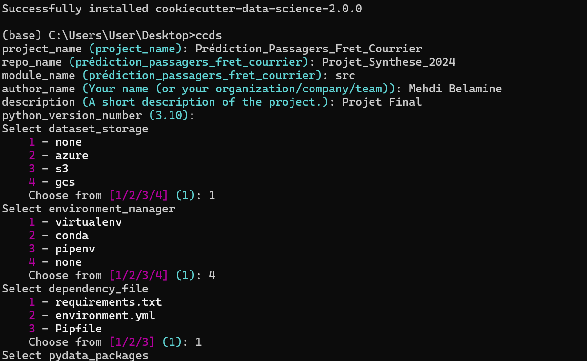
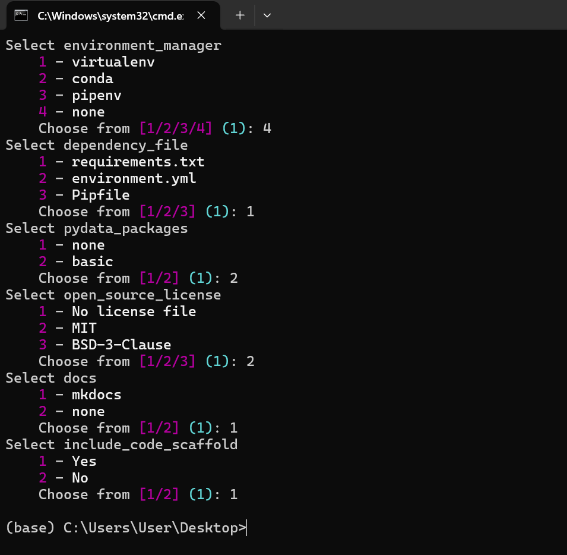
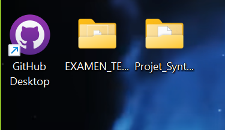

# Preparation de l'environnement :

### 1) Création d’un repository central dans github :

- https://github.com/BMandI/Projet_Synthese_2024.git

### 2) Installation de cookiecutter-data-science pour la création de la structure du projet:

- Documentation sur : https://cookiecutter-data-science.drivendata.org/all-options/

```cmd
pip install cookiecutter-data-science
```

```cmd
ccds
```




On obtient la structure suivante :

## Project Organization

```
├── LICENSE            <- Open-source license if one is chosen
├── Makefile           <- Makefile with convenience commands like `make data` or `make train`
├── README.md          <- The top-level README for developers using this project.
├── data
│   ├── external       <- Data from third party sources.
│   ├── interim        <- Intermediate data that has been transformed.
│   ├── processed      <- The final, canonical data sets for modeling.
│   └── raw            <- The original, immutable data dump.
│
├── docs               <- A default mkdocs project; see mkdocs.org for details
│
├── models             <- Trained and serialized models, model predictions, or model summaries
│
├── notebooks          <- Jupyter notebooks. Naming convention is a number (for ordering),
│                         the creator's initials, and a short `-` delimited description, e.g.
│                         `1.0-jqp-initial-data-exploration`.
│
├── pyproject.toml     <- Project configuration file with package metadata for src
│                         and configuration for tools like black
│
├── references         <- Data dictionaries, manuals, and all other explanatory materials.
│
├── reports            <- Generated analysis as HTML, PDF, LaTeX, etc.
│   └── figures        <- Generated graphics and figures to be used in reporting
│
├── requirements.txt   <- The requirements file for reproducing the analysis environment, e.g.
│                         generated with `pip freeze > requirements.txt`
│
├── setup.cfg          <- Configuration file for flake8
│
└── src                <- Source code for use in this project.
    │
    ├── __init__.py    <- Makes src a Python module
    │
    ├── data           <- Scripts to download or generate data
    │   └── make_dataset.py
    │
    ├── features       <- Scripts to turn raw data into features for modeling
    │   └── build_features.py
    │
    ├── models         <- Scripts to train models and then use trained models to make
    │   │                 predictions
    │   ├── predict_model.py
    │   └── train_model.py
    │
    └── visualization  <- Scripts to create exploratory and results oriented visualizations
        └── visualize.py
```

--------
- Notre projet a été créé sur le Desktop :



### 3) Mettre a jour le Repository Github en versionnant notre code avec git en suivant les etapes suivantes :


```cmd
git init
```

```cmd
git add .
```

```cmd
git commit -m " Creation de la structure du projet"
```

```cmd
git remote add origin https://github.com/BMandI/Projet_Synthese_2024.git
```

```cmd
git branch -M main
```

```cmd
git push -u origin main
```
